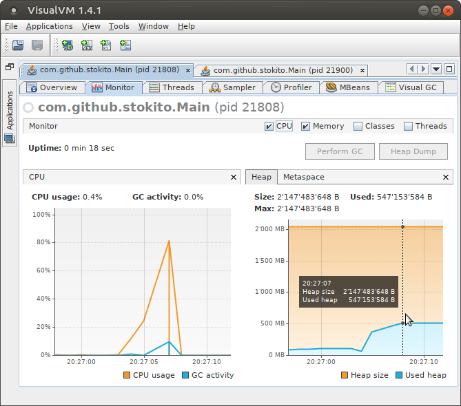
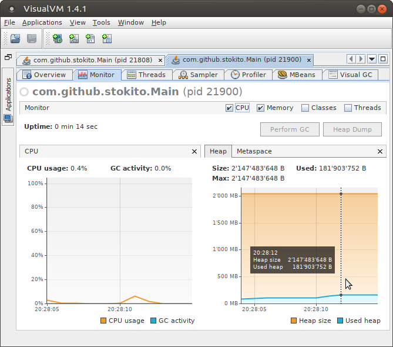

# jsmallmap - POC of simplest as possible Java Map
Proof of Concept (POC, experiment) of implementing of fastest Map class for small amount of entries.
You can call it "SimpleMap" or "SmallMap" or "TupleMap" or "Vals" (see bellow why).

Java's standard `HashMap` is just great: it is fast and memory efficient.
It's so smart that on big elements number it internally switches to `TreeMap`. 
It's genius but not as this `SmallMap`. 

It works quite stupid: each key and each value are stored in... fields `key1`, `val1`, `key2`, `val2`... `key5`, `val5`:
```java
public final class SmallMap<K, V> implements Map<K, V> {
    private K key1;
    private V val1;
    private K key2;
    private V val2;
    private K key3;
    private V val3;
    private K key4;
    private V val4;
    private K key5;
    private V val5;

    public boolean containsKey(Object key) {
        return key.equals(key1) || key.equals(key2) || key.equals(key3) || key.equals(key4) || key.equals(key5);
    }
   
    ...
}    
```
Yes, it is possible to store only five entries in ten fields. And if you try to put more entries you'll get an exception (sic!).

Not so much to be honest, but in practice this is enough for most cases:
* When map is created to pass or return multiple values into a method i.e. the map is used as [tuple](https://docs.microsoft.com/en-us/dotnet/api/system.tuple?view=netframework-4.7.1).
* As imitation of object when you don't want to create a separate class. 
* To pass placeholder variables to formatters
* it's enough to store params of most HTTP requests
* Almost all unit tests uses few entries. 

The SmallMap is intended to be fast (but not *fastest*) but to have smallest memory consumption (about 56 bytes per instance).
You can say: "Who cares? HashMap is already fast and with reasonably small memory footprint. Today we have gibibytes of memory".
And you are partially right: we do have gibibytes of RAM but we have only about 256kb or processor cache. E.g. on my computer:  

    $ lscpu | grep "Cache"
    L1d Cache:                     32K
    L1i Cache:                     32K
    L2 Cache:                      256K
    L3 Cache:                      6144K

To understand how this is very important see [Latency Numbers Every Programmer Should Know](https://gist.github.com/jboner/2841832).
Today enterprise applications contains thousands of instances of hash map and it becomes a problem because it takes more time to collect a garbage. 
So a main idea is to make so small map so it can fit into CPU cache and all it's entries are tied together to be prefetched.
I expect that this can be especially useful in conjunction with [compact objects](http://objectlayout.github.io/ObjectLayout/) that are still not added to JDK :(

# Design principles
Here is some trade-off which method should be fast and which can be slow. Since the class will be used as tuple I chose the following priority: 
1. `put()` and `get()` should be fastest methods because are used the most: this is achieved.
2. `putAll()` and copy constructor: current implementation can be faster
3. iteration by entry set: current implementation is dramatically slow.
4. `toString()` but current implementation is too slow.
5. `size()` and `isEmpty()` current implementation is fastest as possible.
6. `remove()` is fast enough and `clean()` makes immediately (just set size = 0) but can cause memory leaks because it don't nulls fields and references are alive.
7. get keys set and values list: current implementation is too slow and returns inline class (can cause memory leak). Also I think to return just usual ArrayList.

# Benchmark result
It's hard to benchmark SimpleMap because it's overhead is too small to measure. Also it is hard to compare it with HashMap.
Usually maps are benchmarked on large amounts of entries while here we should do opposite.
Especially it's hard to imitate the main usage of SimpleMap: as tuple returned from methods.
I made a synthetic test to roughly estimate allocation of 2000000 maps in **old memory** with putting and getting 5 entries:

    hash map
    Spent time: 3249.609999ms
    Consumed mem: 503_633.734375kb


    
    simple map
    Spent time: 206.163396ms
    Consumed mem: 125_952.5078125kb



Simple map consumed 4 less memory and worked 16 times fast. And when I tried 4000000 entries HashMap test just died with OOM.
To reproduce it run Main class with -Xms2G -Xmx2G vm options.

Looks impressive but don't trust this results it doesn't count a lot of things. 
So here is a [JMH](http://openjdk.java.net/projects/code-tools/jmh/) benchmark. To compile and run it use:

    mvn clean isntall
    java -jar target/benchmarks.jar -gc true

Example on my machine:
```
$ java -jar target/benchmarks.jar -wi 1 -wf 1  -tu ms -i 1 -foe true -gc true
# JMH version: 1.21
# VM version: JDK 1.8.0_172, OpenJDK 64-Bit Server VM, 25.172-b01
# VM invoker: /usr/lib/jvm/zulu-8-amd64/jre/bin/java
# VM options: <none>
# Warmup: 1 iterations, 10 s each
# Measurement: 1 iterations, 10 s each
# Timeout: 10 min per iteration
# Threads: 1 thread, will synchronize iterations
# Benchmark mode: Throughput, ops/time
# Benchmark: com.github.stokito.jsmallmap.MapGetBenchmarkHashMap.testGetExistingKey

# Run progress: 0.00% complete, ETA 00:08:00
# Warmup Fork: 1 of 1
# Warmup Iteration   1: 93048.337 ops/ms
Iteration   1: 95865.900 ops/ms

# Run progress: 4.17% complete, ETA 00:08:18
# Fork: 1 of 5
# Warmup Iteration   1: 101128.778 ops/ms
Iteration   1: 95751.945 ops/ms

# Run progress: 8.33% complete, ETA 00:07:56
# Fork: 2 of 5
# Warmup Iteration   1: 101414.455 ops/ms
Iteration   1: 97438.395 ops/ms

# Run progress: 12.50% complete, ETA 00:07:33
# Fork: 3 of 5
# Warmup Iteration   1: 100620.146 ops/ms
Iteration   1: 96121.147 ops/ms

# Run progress: 16.67% complete, ETA 00:07:12
# Fork: 4 of 5
# Warmup Iteration   1: 101047.375 ops/ms
Iteration   1: 95453.143 ops/ms

# Run progress: 20.83% complete, ETA 00:06:50
# Fork: 5 of 5
# Warmup Iteration   1: 92704.572 ops/ms
Iteration   1: 97963.531 ops/ms


Result "com.github.stokito.jsmallmap.MapGetBenchmarkHashMap.testGetExistingKey":
  96545.632 ±(99.9%) 4223.053 ops/ms [Average]
  (min, avg, max) = (95453.143, 96545.632, 97963.531), stdev = 1096.714
  CI (99.9%): [92322.579, 100768.685] (assumes normal distribution)


# JMH version: 1.21
# VM version: JDK 1.8.0_172, OpenJDK 64-Bit Server VM, 25.172-b01
# VM invoker: /usr/lib/jvm/zulu-8-amd64/jre/bin/java
# VM options: <none>
# Warmup: 1 iterations, 10 s each
# Measurement: 1 iterations, 10 s each
# Timeout: 10 min per iteration
# Threads: 1 thread, will synchronize iterations
# Benchmark mode: Throughput, ops/time
# Benchmark: com.github.stokito.jsmallmap.MapGetBenchmarkSmallMap.testGetExistingKey

# Run progress: 25.00% complete, ETA 00:06:28
# Warmup Fork: 1 of 1
# Warmup Iteration   1: 87076.730 ops/ms
Iteration   1: 102284.825 ops/ms

# Run progress: 29.17% complete, ETA 00:06:07
# Fork: 1 of 5
# Warmup Iteration   1: 103375.736 ops/ms
Iteration   1: 102057.327 ops/ms

# Run progress: 33.33% complete, ETA 00:05:45
# Fork: 2 of 5
# Warmup Iteration   1: 103539.351 ops/ms
Iteration   1: 101001.101 ops/ms

# Run progress: 37.50% complete, ETA 00:05:23
# Fork: 3 of 5
# Warmup Iteration   1: 103124.491 ops/ms
Iteration   1: 102739.695 ops/ms

# Run progress: 41.67% complete, ETA 00:05:02
# Fork: 4 of 5
# Warmup Iteration   1: 104078.998 ops/ms
Iteration   1: 103313.823 ops/ms

# Run progress: 45.83% complete, ETA 00:04:40
# Fork: 5 of 5
# Warmup Iteration   1: 104092.804 ops/ms
Iteration   1: 102876.948 ops/ms


Result "com.github.stokito.jsmallmap.MapGetBenchmarkSmallMap.testGetExistingKey":
  102397.779 ±(99.9%) 3472.132 ops/ms [Average]
  (min, avg, max) = (101001.101, 102397.779, 103313.823), stdev = 901.702
  CI (99.9%): [98925.647, 105869.911] (assumes normal distribution)


# JMH version: 1.21
# VM version: JDK 1.8.0_172, OpenJDK 64-Bit Server VM, 25.172-b01
# VM invoker: /usr/lib/jvm/zulu-8-amd64/jre/bin/java
# VM options: <none>
# Warmup: 1 iterations, 10 s each
# Measurement: 1 iterations, 10 s each
# Timeout: 10 min per iteration
# Threads: 1 thread, will synchronize iterations
# Benchmark mode: Throughput, ops/time
# Benchmark: com.github.stokito.jsmallmap.MapPutBenchmarkHashMap.testGetExistingKey

# Run progress: 50.00% complete, ETA 00:04:19
# Warmup Fork: 1 of 1
# Warmup Iteration   1: 45491.887 ops/ms
Iteration   1: 46182.367 ops/ms

# Run progress: 54.17% complete, ETA 00:03:57
# Fork: 1 of 5
# Warmup Iteration   1: 44754.447 ops/ms
Iteration   1: 47338.460 ops/ms

# Run progress: 58.33% complete, ETA 00:03:35
# Fork: 2 of 5
# Warmup Iteration   1: 46154.465 ops/ms
Iteration   1: 47402.071 ops/ms

# Run progress: 62.50% complete, ETA 00:03:14
# Fork: 3 of 5
# Warmup Iteration   1: 44115.687 ops/ms
Iteration   1: 47156.044 ops/ms

# Run progress: 66.67% complete, ETA 00:02:52
# Fork: 4 of 5
# Warmup Iteration   1: 46325.751 ops/ms
Iteration   1: 46930.896 ops/ms

# Run progress: 70.83% complete, ETA 00:02:31
# Fork: 5 of 5
# Warmup Iteration   1: 46964.208 ops/ms
Iteration   1: 47271.465 ops/ms


Result "com.github.stokito.jsmallmap.MapPutBenchmarkHashMap.testGetExistingKey":
  47219.787 ±(99.9%) 713.935 ops/ms [Average]
  (min, avg, max) = (46930.896, 47219.787, 47402.071), stdev = 185.407
  CI (99.9%): [46505.852, 47933.722] (assumes normal distribution)


# JMH version: 1.21
# VM version: JDK 1.8.0_172, OpenJDK 64-Bit Server VM, 25.172-b01
# VM invoker: /usr/lib/jvm/zulu-8-amd64/jre/bin/java
# VM options: <none>
# Warmup: 1 iterations, 10 s each
# Measurement: 1 iterations, 10 s each
# Timeout: 10 min per iteration
# Threads: 1 thread, will synchronize iterations
# Benchmark mode: Throughput, ops/time
# Benchmark: com.github.stokito.jsmallmap.MapPutBenchmarkSmallMap.testGetExistingKey

# Run progress: 75.00% complete, ETA 00:02:09
# Warmup Fork: 1 of 1
# Warmup Iteration   1: 92842.665 ops/ms
Iteration   1: 90950.677 ops/ms

# Run progress: 79.17% complete, ETA 00:01:47
# Fork: 1 of 5
# Warmup Iteration   1: 91092.506 ops/ms
Iteration   1: 94031.651 ops/ms

# Run progress: 83.33% complete, ETA 00:01:26
# Fork: 2 of 5
# Warmup Iteration   1: 92122.501 ops/ms
Iteration   1: 95148.875 ops/ms

# Run progress: 87.50% complete, ETA 00:01:04
# Fork: 3 of 5
# Warmup Iteration   1: 90051.287 ops/ms
Iteration   1: 96090.860 ops/ms

# Run progress: 91.67% complete, ETA 00:00:43
# Fork: 4 of 5
# Warmup Iteration   1: 96824.209 ops/ms
Iteration   1: 94219.751 ops/ms

# Run progress: 95.83% complete, ETA 00:00:21
# Fork: 5 of 5
# Warmup Iteration   1: 88578.347 ops/ms
Iteration   1: 95438.660 ops/ms


Result "com.github.stokito.jsmallmap.MapPutBenchmarkSmallMap.testGetExistingKey":
  94985.959 ±(99.9%) 3306.885 ops/ms [Average]
  (min, avg, max) = (94031.651, 94985.959, 96090.860), stdev = 858.788
  CI (99.9%): [91679.074, 98292.844] (assumes normal distribution)


# Run complete. Total time: 00:08:38

REMEMBER: The numbers below are just data. To gain reusable insights, you need to follow up on
why the numbers are the way they are. Use profilers (see -prof, -lprof), design factorial
experiments, perform baseline and negative tests that provide experimental control, make sure
the benchmarking environment is safe on JVM/OS/HW level, ask for reviews from the domain experts.
Do not assume the numbers tell you what you want them to tell.

Benchmark                                    Mode  Cnt       Score      Error   Units
MapGetBenchmarkHashMap.testGetExistingKey   thrpt    5   96545.632 ± 4223.053  ops/ms
MapGetBenchmarkSmallMap.testGetExistingKey  thrpt    5  102397.779 ± 3472.132  ops/ms
MapPutBenchmarkHashMap.testGetExistingKey   thrpt    5   47219.787 ±  713.935  ops/ms
MapPutBenchmarkSmallMap.testGetExistingKey  thrpt    5   94985.959 ± 3306.885  ops/ms
```

Get works twice faster while put is just slightly faster. Here maps was created in **new memory**.

# Memory footprint
The instance of `SmallMap` takes 56 bytes see [jol](http://openjdk.java.net/projects/code-tools/jol/) output: 
```
# Running 64-bit HotSpot VM.
# Using compressed oop with 0-bit shift.
# Using compressed klass with 3-bit shift.
# Objects are 8 bytes aligned.
# Field sizes by type: 4, 1, 1, 2, 2, 4, 4, 8, 8 [bytes]
# Array element sizes: 4, 1, 1, 2, 2, 4, 4, 8, 8 [bytes]

com.github.stokito.jsmallmap.SmallMap object internals:
 OFFSET  SIZE               TYPE DESCRIPTION                               VALUE
      0    12                    (object header)                           N/A
     12     1               byte SmallMap.size                             N/A
     13     3                    (alignment/padding gap)                  
     16     4   java.lang.Object SmallMap.key1                             N/A
     20     4   java.lang.Object SmallMap.val1                             N/A
     24     4   java.lang.Object SmallMap.key2                             N/A
     28     4   java.lang.Object SmallMap.val2                             N/A
     32     4   java.lang.Object SmallMap.key3                             N/A
     36     4   java.lang.Object SmallMap.val3                             N/A
     40     4   java.lang.Object SmallMap.key4                             N/A
     44     4   java.lang.Object SmallMap.val4                             N/A
     48     4   java.lang.Object SmallMap.key5                             N/A
     52     4   java.lang.Object SmallMap.val5                             N/A
Instance size: 56 bytes
Space losses: 3 bytes internal + 0 bytes external = 3 bytes total
```
Note that `byte size` was padded to int but I still wan't to use byte just for feature test with compact objects.

From heap dump the size of instance SmallMap<Integer,Integer> is 97. 
 
The empty HashMap is smaller and consumes only 48 bytes but with five values it becomes much bigger.
From heap dump the size is 64 and retained: 372 i.e. more in 3 times than SmallMap.  
 
# Vals: simple and universal collection
But what is more interesting for me is to try to create an universal class which can be used as Tuple as Map, as List and Set and call it Vals.
The similar conception is used in dynamic languages where object is just a map and you can use it as array.
Thus you can easily write everywhere something like: 
```java
// use as list
List<String> usernames = Vals.listOf("admin", "user", "guest"));
assert usernames.val1 == "admin"; 
assert usernames.val2 == "user"; 
assert usernames.val3 == "guest"; 
// use as set: duplicated removed on creation 
Set<String> goods = Vals.setOf("beer", "vodka", "beer"));
assert goods.val1 == "beer"; 
assert goods.val2 == "vodka"; 
assert goods.val3 == null;
// try to add duplicate
goods.add("beer");
assert goods.size() == 2; // still no dups
``` 

  
# Related works and discussions
* https://www.nayuki.io/page/compact-hash-map-java
* https://github.com/OpenHFT/SmoothieMap
* See [Which implementation of Map<K,V> should I use if my map needs to be small more than fast?](https://stackoverflow.com/questions/8835928/which-implementation-of-mapk-v-should-i-use-if-my-map-needs-to-be-small-more-t)
* https://github.com/Zteve/SmallCollections
* https://developer.android.com/reference/android/support/v4/util/ArrayMap
* https://github.com/austinv11/Long-Map-Benchmarks/blob/master/src/jmh/java/com/austinv11/bench/MapTests.java